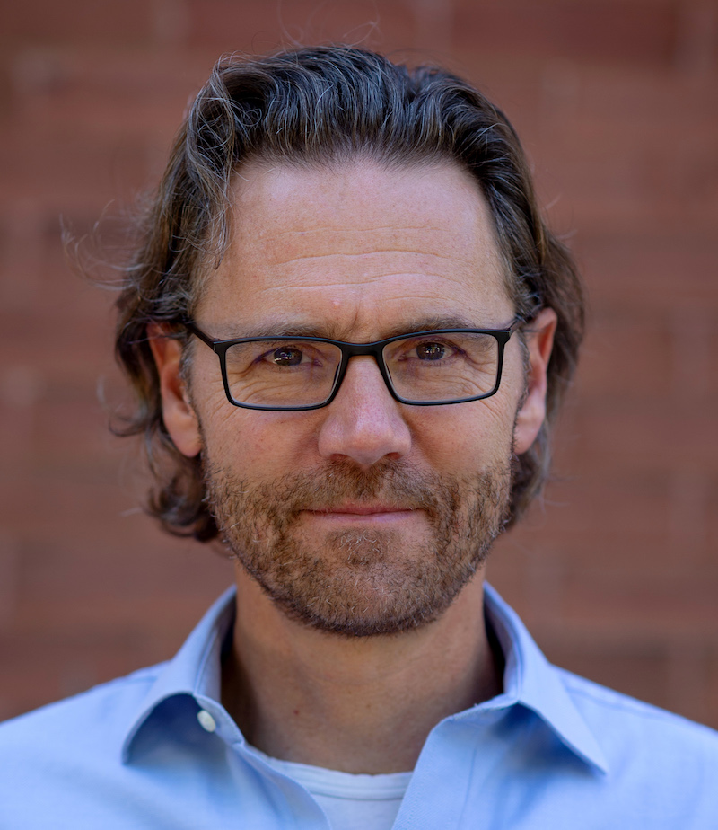

---
# Feel free to add content and custom Front Matter to this file.
# To modify the layout, see https://jekyllrb.com/docs/themes/#overriding-theme-defaults

layout: page
title: Jeff Orchard
---

**Associate Professor** 
&ensp;[David R. Cheriton School of Computer Science](http://cs.uwaterloo.ca){:target="_blank"} 
&ensp;[University of Waterloo](http://uwaterloo.ca){:target="_blank"} 
**Director** 
&ensp;[Neurocognitive Computing Lab](http://neurocog.uwaterloo.ca){:target="_blank"} 
**Core Member** 
&ensp;[Centre for Theoretical Neuroscience](http://ctn.uwaterloo.ca){:target="_blank"}

---

I've been interested in the brain -- and how it governs our behaviour -- since high school. Naturally, I went to university to study math (*sarcasm). I spent some time doing research in image processing and medical imaging, but eventually returned to my passion, the brain.

But enough about me... let's talk about me.

In my view, computer science plays an essential role in understanding the brain, understanding the patterns that emerge from the interactions of millions or billions of simple computing units (neurons).

The ultimate goal is to find something akin to "_the theory of evolution_" for the brain. Evolution uses a small number of simple mechanisms to explain the vast diversity of living things, and their relationships. In neuroscience, we seek a small set of simple mechanistic rules that govern the development and operation of the brain, resulting in cognition and complex behaviours.

My students and I form the [Neurocognitive Computing Lab](http://neurocog.uwaterloo.ca){:target="_blank"}. Through computational experiments and mathematical analysis, we try to understand the neurological basis of perception, cognition, and behaviour.

---

## More Details <a name="details">
- BMath in [Applied Mathematics, University of Waterloo](https://uwaterloo.ca/applied-mathematics/){:target="_blank"}, 1994
- [MSc](https://dx.doi.org/10.14288/1.0079674){:target="_blank"} in [Applied Mathematics, University of British Columbia](https://www.iam.ubc.ca/){:target="_blank"}, 1996
- [PhD](http://summit.sfu.ca/item/7528){:target="_blank"} in [Computing Science, Simon Fraser University](http://www.sfu.ca/computing.html){:target="_blank"}, 2003

<!--  -->
